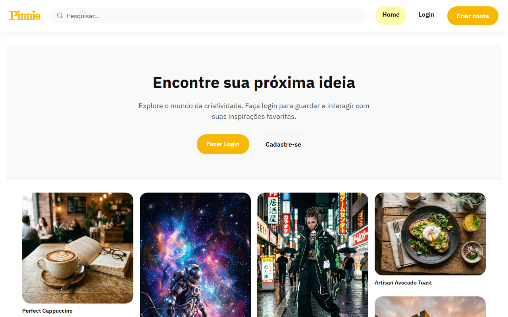
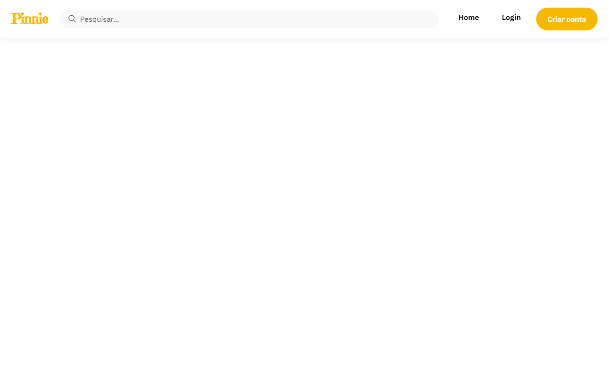
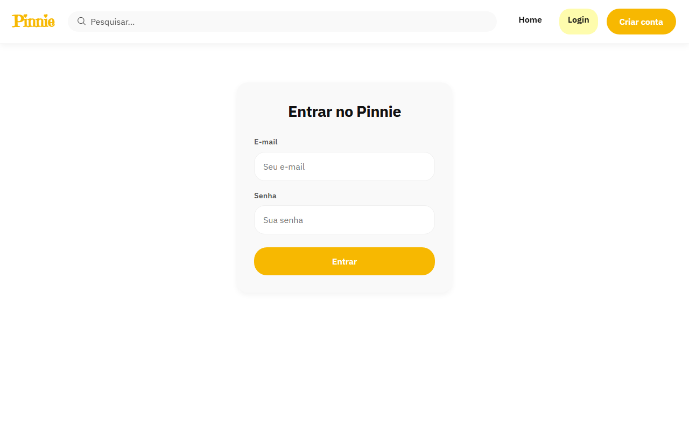

# Pinnie 📌

Uma plataforma minimalista e elegante para descoberta, organização e compartilhamento de conteúdo visual. 

O Pinnie permite que os usuários explorem imagens (Pins), salvem suas inspirações em pastas organizadas (Boards) e interajam com a comunidade através de comentários, curtidas e seguidores, tudo em um ambiente seguro e bem estruturado.


---

## 📸 Preview

<div align="center">
  
</div>

---

## ✨ Sobre o projeto

O Pinnie foi desenvolvido como um projeto de portfólio full-stack ponta-a-ponta, demonstrando a capacidade de arquitetar, construir e realizar o deploy de uma aplicação complexa. O objetivo foi criar uma rede social visual focada em performance, segurança e uma interface de usuário agradável, evitando o uso de frameworks CSS pesados e priorizando a fluidez com CSS Vanilla e Composition API.

---

## 🚀 Funcionalidades

### Autenticação e Usuários
* **Cadastro e Login** seguros via JWT (HttpOnly Cookies).
* **Perfil de Usuário** com alteração de avatar, nome, bio e senha.
* Gerenciamento de sessão persistente no frontend (Pinia).

### Pins (Conteúdo Visual)
* **Upload de Imagens** com validação estrita (tamanho máximo de 10MB e formato).
* **Feed Dinâmico** utilizando layout Masonry e Infinite Scroll suportado por paginação nativa via **Spring Data Slice** (mais leve que `Page` por evitar count queries no banco).
* **Busca Global** de Pins por título e descrição.
* **Criação e Exclusão** de Pins (apenas pelo autor ou admin).

### Organização
* **Boards (Pastas):** Criação de pastas públicas ou privadas.
* **Salvamento:** Adicionar e remover Pins de Boards.
* **Privacidade:** Pastas privadas ficam invisíveis para visitantes.

### Interações Sociais
* **Seguidores:** Seguir e deixar de seguir outros usuários.
* **Curtidas:** Favoritar Pins.
* **Comentários:** Comentar em Pins com navegação direta para o perfil do autor do comentário.

### Moderação e Administração
* **Denúncias (Reports):** Usuários podem denunciar Pins abusivos.
* **Painel Administrativo:** Visualização e resolução de denúncias.
* **Bloqueio:** Administradores podem bloquear usuários infratores (revogação imediata de acesso) e deletar Pins do sistema.

---

## 🖥️ Screenshots / Interface

### Login


### Perfil do Usuário


### Painel Administrativo


---

## 🏗️ Arquitetura

O projeto adota uma arquitetura clássica de Cliente-Servidor separada:

### Backend (Spring Boot 3.3.3)
Construído com Java 17. Utiliza **Spring Web** para os controllers RESTful, **Spring Data JPA / Hibernate** para persistência, e **Spring Security** para proteção de rotas. O código segue padrões rígidos de DTOs, evitando o vazamento de Entidades JPA pelas rotas da API. Conta também com **Swagger/OpenAPI** embutido para documentação da API.

### Frontend (Vue 3.5.40)
Uma Single Page Application (SPA) reativa construída com **Vite 8.2.0**, **Vue 3 (Composition API / Script Setup)**, **Vue Router** para navegação e **Pinia 4.0.3** para gerenciamento de estado global. As requisições HTTP são feitas de forma interceptada via **Axios**.

### Banco de Dados (PostgreSQL)
Banco relacional rodando via Docker. A evolução do schema é versionada e aplicada automaticamente pelo **Flyway**, garantindo reprodutibilidade do banco.

### Armazenamento de Arquivos
A aplicação utiliza o padrão *Strategy* (`ImageStorageService`), permitindo salvar imagens localmente em disco (para desenvolvimento) ou diretamente no **Amazon S3 / Supabase Storage** (para produção) com a simples troca de uma variável de ambiente.

---

## 🧩 Estrutura do projeto

```text
pinnie/
├── backend/
│   ├── src/main/java/com/pinnie/
│   │   ├── config/       # Configurações globais e OpenAPI
│   │   ├── controller/   # REST APIs
│   │   ├── dto/          # Data Transfer Objects
│   │   ├── exception/    # Handlers globais de erro
│   │   ├── model/        # Entidades JPA
│   │   ├── repository/   # Interfaces Spring Data
│   │   ├── security/     # Filtros JWT, UserDetailsService e CSRF
│   │   └── service/      # Regras de Negócio e Storage
│   ├── src/main/resources/db/migration/ # Flyway
│   ├── Dockerfile
│   └── pom.xml
├── frontend/
│   ├── src/
│   │   ├── assets/       # CSS global
│   │   ├── components/   # Componentes Vue reutilizáveis
│   │   ├── router/       # Rotas do Vue
│   │   ├── services/     # Configuração Axios
│   │   ├── stores/       # Estado global (Pinia)
│   │   └── views/        # Páginas da aplicação
│   ├── Dockerfile
│   ├── nginx.conf
│   └── package.json
└── docker-compose.prod.yml
```

---

## 🔐 Segurança

O Pinnie leva segurança a sério. Nenhuma credencial trafega solta e as defesas incluem:
* **JWT Isolado:** Tokens de sessão trafegam exclusivamente via Cookies `HttpOnly` e `Secure`, tornando a aplicação imune a roubo de token via XSS.
* **CSRF Ativo:** Utiliza `CookieCsrfTokenRepository` configurado para SPAs com Spring Security, emitindo tokens `XSRF` em rotas não-GET.
* **CORS Restrito:** Origens permitidas são injetadas por variáveis de ambiente, bloqueando acessos não autorizados à API.
* **Validação de Uploads:** Limites de tamanho (10MB) aplicados e processamento estrito.
* **Autorização Imediata:** Verificação de status `enabled` no banco em tempo real a cada requisição, garantindo que o bloqueio de um usuário entre em vigor imediatamente.
* **Controle de Acesso:** Proteção IDOR em endpoints (usuários só podem deletar/editar os próprios boards e pins). Rotas administrativas protegidas por `@PreAuthorize` e filtros de Role.

---

## 🗄️ Banco de dados

Gerenciado inteiramente por **Flyway**, o banco possui 12 migrations (V1 a V12) abrangendo as tabelas:
* `users` e `roles`
* `boards`, `pins`, `board_pins`
* `comments`, `pin_likes`, `user_follows`
* `reports` (sistema de denúncias)

Os relacionamentos utilizam `UUID` (e não inteiros auto-incrementais) como chaves primárias, o que mitiga a enumeração previsível de registros. A segurança real contra acesso indevido (IDOR) é garantida estritamente pelas regras de autorização e verificação de propriedade implementadas no backend.

---

## 🔌 API e Swagger

A API é documentada automaticamente utilizando **springdoc-openapi**. Quando o backend estiver rodando localmente, toda a interface da API pode ser explorada interativamente acessando:
`http://localhost:8080/swagger-ui/index.html`

Principais grupos de endpoints:
* **Autenticação:** `/api/auth/login`, `/api/auth/logout`, etc.
* **Feed:** `/api/feed` (retornando o modelo Slice)
* **Pins e Boards:** Operações de CRUD completos
* **Social:** Interações de curtidas e follows
* **Admin:** Moderação de conteúdo e perfis

---

## 🧪 Testes

A aplicação utiliza uma abordagem mista e moderna para qualidade de código:
* **Testes de Integração:** Usando **Testcontainers** (Docker via Java) para subir bancos de dados PostgreSQL efêmeros durante os testes.
* **Testes Unitários:** Isolamento de regras de negócio com **JUnit** e **Mockito**.
Para rodar a suíte completa via terminal:
```bash
./mvnw test
```

---

## 🐳 Executando o projeto localmente

### Pré-requisitos
- **Java 17** e Maven instalados
- **Node.js 18+** e npm instalados
- **Docker** e **Docker Compose**

### Passo 1: Subir o Banco de Dados
Na raiz do projeto, inicie o PostgreSQL usando o compose de desenvolvimento:
```bash
docker-compose up -d
```

### Passo 2: Configurar o Frontend
Crie o arquivo de variáveis de ambiente do frontend:
```bash
cd frontend
cp .env.example .env
npm install
npm run dev
```

### Passo 3: Executar o Backend
Em outro terminal:
```bash
cd backend
./mvnw spring-boot:run
```
O backend vai aplicar as migrations automaticamente e iniciar na porta `8080`.
O frontend estará acessível em `http://localhost:5173`.

---

## ⚙️ Variáveis de ambiente

As principais variáveis configuráveis no backend (`application.yml` ou exportadas no servidor):

```env
DB_URL=jdbc:postgresql://localhost:5433/pinnie_db
DB_USERNAME=pinnie_user
DB_PASSWORD=pinnie_password
JWT_SECRET=sua_chave_secreta_super_forte_aqui
CORS_ALLOWED_ORIGINS=http://localhost:5173

# Opcional (Para ativar o upload na nuvem)
# app.storage.type=s3
# app.storage.s3.bucket=meu-bucket
# app.storage.s3.access-key=...
```

---

## 📦 Deploy (Produção)

O repositório inclui um `docker-compose.prod.yml` e `Dockerfile`s otimizados para produção.
1. O backend é empacotado em um arquivo `.jar` e servido nativamente via Java.
2. O frontend é compilado (`npm run build`) e os arquivos estáticos resultantes são servidos por um container ultra-rápido **Nginx**, agindo também como proxy reverso para a API.

---

## 📚 Tecnologias utilizadas

### Backend
* Java 17
* Spring Boot 3.3.3 (Web, Security, Data JPA)
* PostgreSQL Driver
* Flyway Migration
* JSON Web Token (jjwt)
* AWS SDK S3

### Frontend
* Vue 3 (Composition API)
* Vite
* Pinia
* Vue Router
* Axios

### Infraestrutura & Deploy
* Docker & Docker Compose
* Nginx

---

## 🛣️ Roadmap

Com a arquitetura central e os 16 módulos primários concluídos (incluindo Moderação e Infraestrutura), futuras atualizações poderão focar em melhorias sociais profundas (como *Threads* nos comentários e Busca Semântica). Novas melhorias serão avaliadas conforme a evolução do projeto.

---

## 📄 Licença

Este é um projeto pessoal construído como peça de portfólio.
