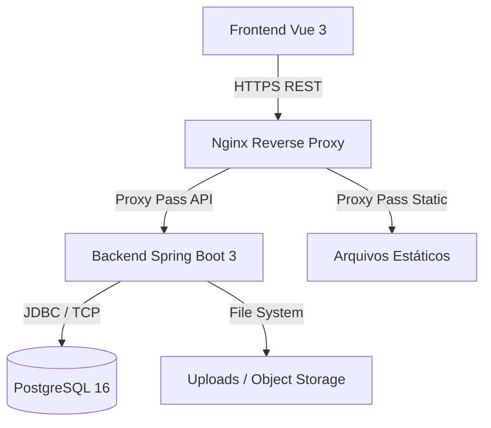

# Arquitetura e Decisões Técnicas — Pinnie

Este documento detalha as decisões de engenharia, stack tecnológica e padrões de segurança adotados no desenvolvimento do Pinnie.

## 1. Visão Geral da Stack

### Backend
- **Linguagem:** Java 17
- **Framework:** Spring Boot 3.x
- **Persistência:** Spring Data JPA / Hibernate
- **Banco de Dados:** PostgreSQL 16
- **Migrations:** Flyway
- **Segurança:** Spring Security (JWT, CSRF, BCrypt)
- **Validação:** Bean Validation (Jakarta Validation)

### Frontend
- **Framework:** Vue 3 (Composition API)
- **Roteamento:** Vue Router
- **Gerenciamento de Estado:** Pinia
- **Estilização:** Vanilla CSS (com variáveis responsivas, CSS Grid e Flexbox)

### Infraestrutura
- **Deploy/Containers:** Docker & Docker Compose
- **Proxy Reverso:** Nginx
- **Controle de Versão:** Git

## 2. Diagrama Macro da Arquitetura

## 3. Segurança e Padrões de Projeto

O Pinnie foi projetado levando a segurança a sério desde o Dia 1. Decisões arquiteturais tomadas para mitigar as principais vulnerabilidades da OWASP Top 10:

- **Autenticação Stateless Segura:** Tokens JWT não são trafegados no corpo da requisição ou `localStorage`, mas sim protegidos dentro de **Cookies HttpOnly** e marcados como `Secure` em produção.
- **Proteção CSRF (Cross-Site Request Forgery):** A aplicação implementa proteção moderna CSRF através do padrão `CookieCsrfTokenRepository` com `XorCsrfTokenRequestAttributeHandler`, integrado nativamente com o Axios no frontend via headers e cookies.
- **Autorização Robusta (Prevenção de IDOR):** Todos os Controladores que gerenciam recursos protegidos (Boards, Pins, Comentários) não confiam na entrada do cliente. A propriedade do recurso é validada a nível de Banco de Dados comparada contra a extração estrita do `UUID` no token do `@AuthenticationPrincipal`.
- **Upload Seguro contra Path Traversal e Execução Remota (RCE):** O armazenamento de imagens valida extensões verificando os **magic bytes** nativos do arquivo via Apache Tika (não confiando no `.png` do frontend), e sanitiza fortemente os caminhos físicos dos arquivos salvos para impedir escape de diretório.
- **Fail-Fast:** A configuração de produção não possui defaults fracos silenciosos. Caso uma credencial forte de banco ou secret JWT falte no ambiente Docker, a aplicação interrompe seu contexto e impede o start (Princípio do Fall-Safe).

## 4. Estratégia de Banco de Dados

- Todo o schema é versionado imperativamente via `V...__script.sql` (Flyway).
- A geração automática via `hibernate-ddl` está expressamente validada/desligada, garantindo total previsibilidade nas implantações e CI/CD.
- Imagens não são armazenadas em `BLOB`. O backend grava apenas uma string padronizada com UUID, mantendo o banco leve e pronto para migração cloud (ex: Amazon S3).
